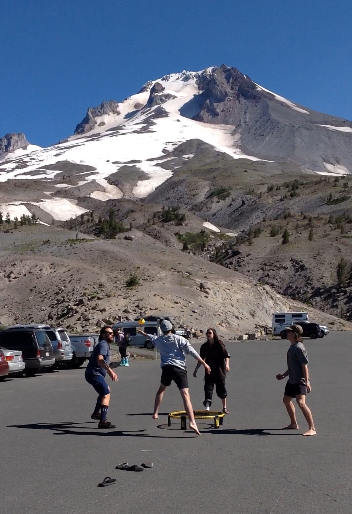
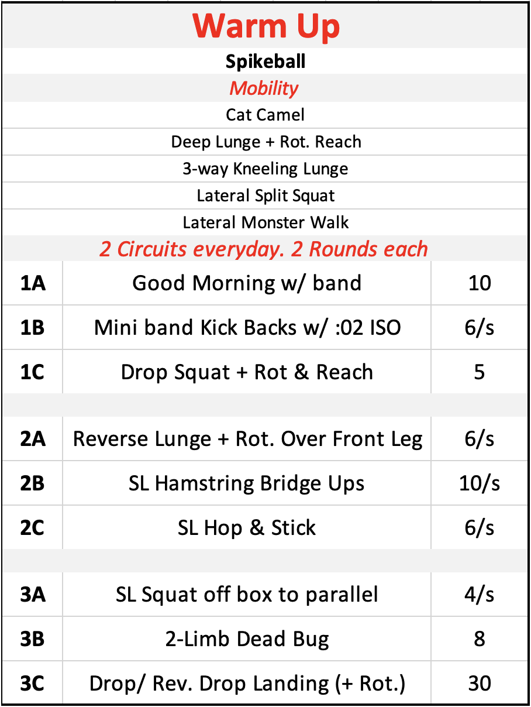
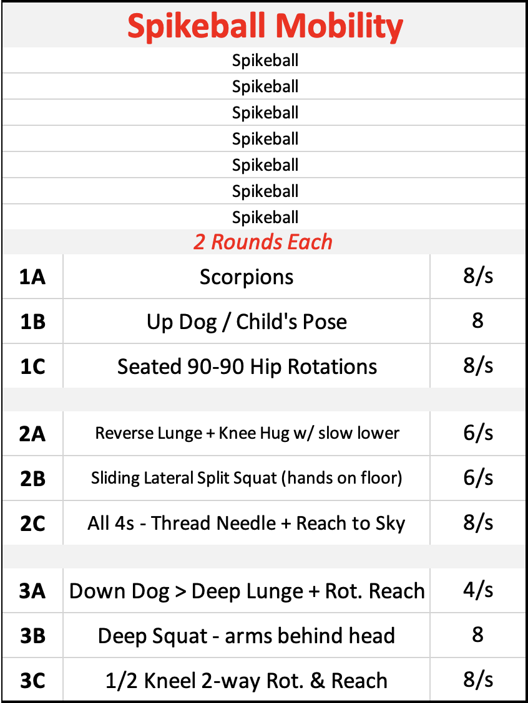

For my first ever blog post, I've decided to write about something that's near and dear to my heart: **Spikeball.**

{fig-align="center" width="278"}

## Phase 0: Warm Up? No Thanks.

Most coaches and athletes know the importance of a well-planned warm-up for performance enhancement and injury prevention. However, that doesn't mean that it's always easy to implement one. When I began travelling for training camps and competitions with the Canadian Freestyle Moguls team in 2016, I learned how difficult it can be to lead a good warm-up on the road. Most of our warm-ups occurred in sub-optimal locations such as cafeterias or hallways, and the only exercise equipment we had was whatever I could squeeze into my backpack.

Little did I know, these would be the least of my problems when I transitioned into working with the Canadian Halfpipe Ski team in 2018. While this team was composed of some of the most outstanding athletes I'd ever seen in person, it's fair to say that the team culture was a little more laid back than the Mogul skiing culture I was accustomed to. My first training camp with the team was at Mammoth Mountain in California, where a good warm-up consisted of some mini-band work in the parking lot, and an average one meant strapping up the ski boots and strolling over to the oh-so-comfortable chairlift.

Team, if you're reading this, I'm sorry. I love you all, but I think we can agree that the pre-skiing warm-up left a bit to be desired. It was clear to me after that first camp that I had a lot of work ahead of me and that this was going to require some outside-the-box thinking.

## Phase 1: The Introduction

::::: columns
::: {.column width="50%"}
So, at our next stop later that summer in Mt. Hood, Oregon, when we rolled up to the parking lot with no sufficient warm-up area in sight, I pulled a brand new black and yellow bag out of the truck and started assembling what looked to the athletes like a mini-trampoline.

A few of them knew what it was, and were vaguely interested to see what I had in mind. The others ranged in feeling from skeptical to embarrassed.

Day one went okay. I taught them the rules and we played a few rounds before they put their boots on and walked to the chairlift. It was far from a perfect warm-up, but I was cautiously optimistic.

But on day 2... the athletes set the Spikeball up on their own, before I even had the chance to ask.
:::

::: {.column width="50%"}
{fig-cap-align="right" style="text-align: right;" fig-align="right" width="280"}
:::
:::::

## Phase 2: The Progression

Very quickly, Spikeball became a standard part of our pre-skiing warm-up. In previous years, I had traveled with an equipment bag filled with elastic bands, cones, ladders, foam rollers, etc. Of course, I still carried those things with me, but I also always made sure their was room in my ski bag for the Spikeball set.

During the first camp in Mt. Hood, I was happy just to let them play, knowing that our mornings were already off to a far more productive start than in Mammoth. But as the season continued, I began to push for just a little bit more out of our warm ups.

Below, you'll see two sample programs. On the left is an example of a basic warm-up starting with Spikeball, and progressing into a more traditional warm-up program. On the right is an example of a "Spikeball Mobility" session, which became a common post-ski activity, incorporating some conditioning, mobility, recovery, and of course some fun competition to help the athletes unwind from the stresses of training.

::::: columns
::: {.column width="50%"}
{fig-align="center" width="400"}
:::

::: {.column width="50%"}
{fig-align="center" width="400"}
:::
:::::

## Sounds fun. But is it Effective?

Let's take a look at Spikeball in the context of the popular **RAMP** protocol. Most coaches will be familiar with using this framework to structure a warm-up using activities to **R**aise, **A**ctivate, **M**obilize, and **P**otentiate [@jeffreys2007].

#### [R]{.underline}aise

This might be the most obvious benefit of Spikeball in comparison to a traditional warm up. It takes only a few good rallies to notice an increase in heart rate, respiration rate and body temperature. This is meant to be a fun blog post, so please excuse the science, but researchers have observed HR~mean~ of 70% and HR~max~ of 84% during Spikeball game-play [@grimm2019].

One important consideration is that you have to make it somewhat competitive by keeping score, which ensures that the game will be played with a bit of intensity[^1]. We play games to 11, with friendly serves to facilitate longer rallies and ensure there isn't too much standing around. Short games allow athletes to sub in and out so everyone gets a turn, and it minimizes the risk of playing too long and causing fatigue.

[^1]: I find athletes will generally self-regulate the intensity and will remain mindful that the overall goal is to warm up for their sport.

#### [A]{.underline}ctivate

This objective might be more difficult to achieve, in the traditional sense. But think about some of the movements that occur during a Spikeball game. You will notice movements that look a lot like forward or lateral lunges. Shoulder stability muscles will be activated when serving or reaching for balls. And, of course, there is the obvious agility and COD work.

#### [M]{.underline}obilize

An under-rated benefit of Spikeball game-play is that the athletes will find themselves making all kinds of different shapes with their bodies. I've already mentioned multi-directional lunges, which will help to open up the hips, but athletes will also naturally be rotating through the thoracic spine and shoulders when chasing and hitting balls, turning their head and neck to follow the ball, and flexing at the knees and ankles to move forward when defending drop shots.

#### [P]{.underline}otentiate

Maybe this is a bit of a stretch, but hear me out. One could argue that the COD and agility work done in a game of Spikeball is preparing the athletes for performing high-intensity landings/deccelerations while attenuating rotational forces. And maybe serving and hitting the ball is preparing them for initiating rotations during take-offs. And maybe the hand eye co-ordination of reaching for a loose ball has some relation to reaching for grabs while spinning and flipping through the air.

Ultimately, in skill sports like Freestyle Skiing, you can only get so close to sport-specific drills in the gym. My philosophy is that I need to help the athletes prepare physically and mentally, so that they show up to their technical training ready to go. Ultimately, they will need to ski some laps for a more specific warm-up on the hill, and will move through progressions from easier to more difficult tricks.

## Phase 3: The Perfect Warm Up

Throughout the four years leading up to the 2022 Beijing Olympic Winter Games, Spikeball remained a consistent part of our warm-up routine. We didn't play every single day, but whenever we had a warm-up area with enough space, or whenever I felt like the team just needed a bit of fun to break up the monotony of training, I would not hesitate to get the net set up. I wouldn't say we ever got to the perfect warm-up, if that even exists, but I'm proud to say that this outside-the-box solution was a great hit.

Although this post is very specifically about my experience with Freestyle Skiing, I think the lessons I learned here can apply to just about any athletic context from youth recreational sport to world-class athletes. The benefits for any athlete will be wide-ranging, from improved motor performance (i.e. coordination, reaction time, etc.) associated with playing different sports, to the emotional and social benefits of becoming immersed in a simple game with teammates.

Of course the perfect warm up will vary greatly for different sports and even for each individual athlete. Nonetheless, if you're looking for a fun and effective way to mix things up for your athletes, I'll leave you with some takeaways that I hope will be useful for coaches looking to include Spikeball as part of the perfect warm up.

-   **Arrive early and have the Spikeball set up when the athletes arrive.** Nothing drives me crazier than athletes starting their warm-up with an absent-minded rolling of their hamstring or a slow spin on the bike while scrolling Instagram. Get them moving right away.

-   **Sequence specific mobility drills immediately after Spikeball.** You could start with mobility if that's what works for you group, but athletes will be primed for some effective mobility work due to increased body temperature and joint viscosity following the game.

-   **Think about what Spikeball is NOT accomplishing for you, and add those stimuli.** In reality, you should probably make sure you are getting in some solid activation and potentiation work. I love to get some high velocity medicine ball work and some jumping and landing drills in near the end of warm-up.

-   **Think about what Spikeball IS accomplishing for you, and remove those stimuli.** I've already mentioned that you no longer have any need for spin bikes or jogging. I'm also less likely to program agility or COD work if we get a good match going.

-   **Don't coach or referee the Spikeball match.** Just let them have fun. Better yet, join in the game if there is a spot available. This will pay off in the long run with greatly improved camaraderie and team morale. Everyone will be having fun and you can be confident that the athletes are getting a great warm-up. It's a win-win.

## Thanks for Reading

If you've made it this far, thanks for reading. I'll finish this post with a list of some of my favourite Spikeball memories from my travels with the team.

-   **Gold Coast, Australia** - During a 5 day cross-training Surf camp we spent equal amounts of time between surfing, trampoline and Spikeball.

-   **Saas Fee Switzerland** - With limited options for space, we resorted to playing in a cow pasture. The locals watched us with disbelief as we tried to avoid "landmines".

-   **Kaprun, Austria**: This was probably the peak of our obsession. We would play late into the evening, even when it got too dark to see.

-   **Wanaka, New Zealand** - Jet-lagged from a 24-hour travel day, the team prioritized Spikeball over sleep while we waited to check into our rental units.
