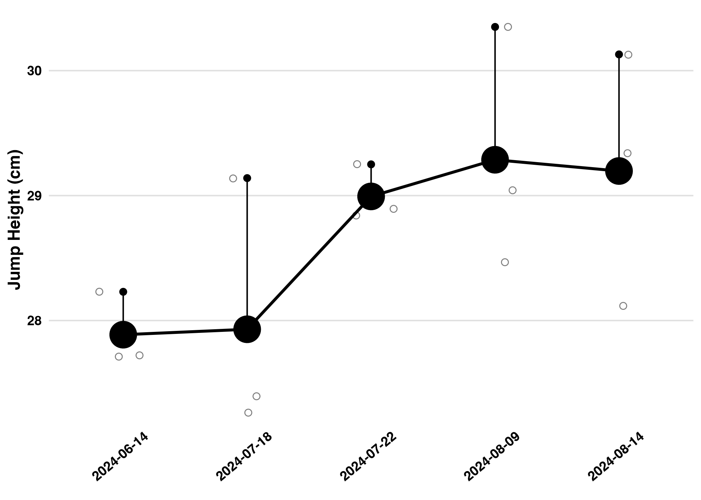

```{r}
#| include: false
library(tidyverse)
library(readxl)
library(magick)
library(beepr)
library(leaflet)
library(janitor)
library(quarto)

source("~/Dropbox/Data Science/Website/plot_functions.R")

recent_five <- read_csv("recent_five.csv")
```

## **Title in Bolds with some code 6\*9=`{r} 6*9`**

```{mermaid}
%%| fig-width: 6.5
flowchart LR
  A[Hard edge] --> B(Round edge)
  B --> C{Decision}
```

## Videos

Here is a video placed by inserting the url into video shortcode like so `` .



Here is a video placed by copying the embed link from youtube/share

<iframe width="560" height="315" src="https://www.youtube.com/embed/pHR07EuEKjM?si=dAsEipz0uDA8q-uN" title="YouTube video player" frameborder="0" allow="accelerometer; autoplay; clipboard-write; encrypted-media; gyroscope; picture-in-picture; web-share" referrerpolicy="strict-origin-when-cross-origin" allowfullscreen>

</iframe >

::: {#nte-example .callout-note title="Tip with Title" collapse="true"}
## This is a note.

hkjhkjhkhkjkjkhjj
:::

Here I can link to my note using \@ @nte-example ...

## Links

`[TSN](https://www.tsn.ca/)` = [TSN](https://www.tsn.ca/)

## Images and Article Layout

This is the code:

``

but in the Visual editor, it's just easier to click on the image image in the toolbar

{width="286"}

Attributes/Classes/.column-body-outset

{#Spikeball1 .column-body-outset}

Attributes/Classes/.column-page

{.column-page}

Some output from code (a table) that is as wide as the screen.

```         
Warning message:
The downlit and xml2 packages are required for code linking
```

```{r}
#| column: screen
#| echo: false

knitr::kable(
  mtcars[1:6, 1:10]
)
```

```{r}
#| column: screen

leaflet() %>%
  addTiles() %>%  # Add default OpenStreetMap map tiles
  addMarkers(lng=-123.12, lat=49.28, popup="Go Leafs Go")
```



------------------------------------------------------------------------

::: column-margin
We know from *the first fundamental theorem of calculus* that for $x$ in $[a, b]$:

$$\frac{d}{dx}\left( \int_{a}^{x} f(u)\,du\right)=f(x).$$
:::

The aside uses the class `.column-margin` , may need to play around with where it should be placed in the visual editor, in order to have it placed correctly when rendered. Looks like maybe it starts at the side of whatever element precedes it.

Here is a quote [@ohta2003]

Here is the main content, below I have written an aside

::: aside
This goes to the side i guess? is there a difference between aside and column-margin?
:::

more main content

## GIFs

Inserted as an image. The gif lives in the working directory for this post.


```{r}
#| eval: false
#| include: false


recent_five %>%
  ggplot(aes(x = factor(Date, ordered = T))) +
  stat_summary(aes(y = flight_height_tov, group = Date), fun = "mean", geom = "point", size = 4) +
  stat_summary(aes(y = flight_height_tov, group = Date), fun = "max", geom = "point", size = 2) +
  stat_summary(aes(y = flight_height_tov), fun.data=mean_peak, geom="pointrange", size = 2) +
  stat_summary(aes(y = flight_height_tov, group = 5), fun = "mean", geom = "line", linewidth = 1) +
  geom_jitter(aes(y = flight_height_tov), shape = 1, size = 2, alpha = 0.5, width = 0.2) +
  #geom_hline(aes(yintercept = mean(as.numeric(flight_height_tov))), alpha = 0.3, linetype = 2, linewidth = 1.5) +
  ak_plot_theme() +
  labs(
    x = NULL,
    y = "Jump Height (cm)",
    title = NULL)

ggsave("beaches.png")

beachplot <- image_read("beaches.png")
wizgif <- image_read("~/Dropbox/Data Science/Website/Posts/2024-08-26-testing-quarto-functions/more-hops.gif")

frames <- image_composite(beachplot, wizgif, offset = "+100+100")

animation <- image_animate(frames, fps = 10)
image_write(animation, "beachwiz.gif")

```

{width="366"}

## Code Anotations

It doesn't seem like code annotations and highlights will work on the same line in html output, will have to choose one or the other. In this case, if `#<1>` comes before `#<<` , the annotations work but the highlighting gets messed up and highlights the wrong line.

Also, if I remove `source-line-numbers: "x"` the output shows the YAML in the rendered doc for some reason.

In this chunk in particular, the `source-line-numbers` doesn't work but the `#<<` does work. May have to check options when using this in the future.

```{r}
#| source-line-numbers: "1"
#| label: fig-mpg
#| column: page-right 
#| fig-cap: City and highway mileage for 38 popular models of cars.
#| fig-subcap: Color by number of cylinders,Color by engine displacement, in liters
#| layout-ncol: 2


ggplot(mpg, aes(x = hwy, y = cty, color = cyl)) + 
  geom_point(alpha = 0.5, size = 2) +                 
  scale_color_viridis_c() + #<<
  theme_minimal() 

ggplot(mpg, aes(x = hwy, y = cty, color = displ)) + 
  geom_point(alpha = 0.5, size = 2) +
  scale_color_viridis_c(option = "E") + #<1>
  theme_minimal() 


```

1.  The ordered list must be placed immediately below the code cell

```{r}
#| source-line-numbers: "2"

iris |> 
  head(5)
```

### Custom layouts for multiple plots

Could be useful for displaying one main plot, supported by 3 smaller plots

```{r}
#| layout: [[100], [30,30,30]]
#| column: body

plot(mtcars)
plot(cars)
plot(pressure)
plot(cars)
```

List

-   A list needs a blank line above it, i.e. cannot be attached to a paragraph

-   this is an unordered list

    -   use tab. to create sub-items

Tight List (cmd-option-9)

-   cross-reference to @fig-mpg
-   cross-ref to @fig-mpg-1
-   and to @fig-mpg-2
-   list

Task list - \[ \] Do this in source editor - \[ \] Do this in Visual Editor?

## Footnotes

Here is a footnote[^1] inserted from the toolbar in the visual editor

[^1]: In the visual editor, it's easy to insert and edit from the toolbar.

> Blockquate using \>

<!--# comment? -->
